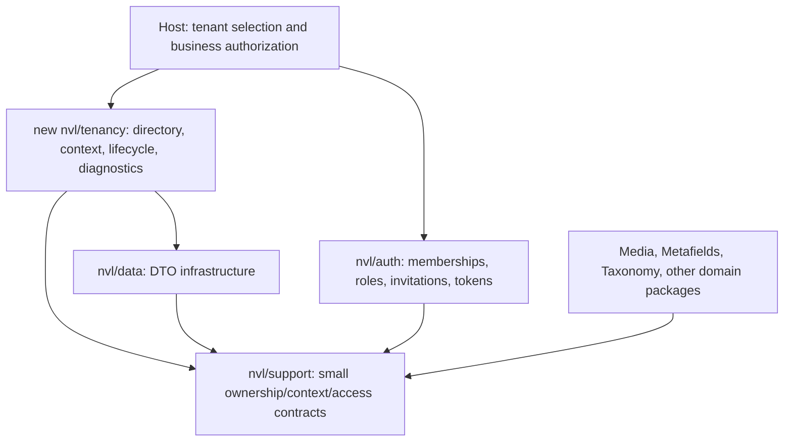

# Configurable Tenancy: Design and Rollout Plan

**Status:** Proposed architecture for review; tenancy is not implemented.

**Baseline:** `e98690f` — the package hardening checkpoint committed on
2026-09-16. The suite currently contains 20 packages.

**Goal:** Let an application opt into tenant isolation across NVL packages while
preserving the existing behavior of applications that do not use tenancy.

**Recommended first release:** A shared database, global user identities with
multiple tenant memberships, and tenant-owned application data. These are
recommendations pending the product decisions below, not approved requirements.

This document is the suite-level design and delivery roadmap. Each workstream
gets a bounded implementation plan after its contracts are reviewed; this is
not an instruction to implement every package in one change.

## 1. Product decisions

Two questions have been presented for review:

1. Shared database, separate database per tenant, or both? Recommend shared
   database for the first release, with no connection-switching implementation.
2. Can an account join several tenants? Recommend yes: credentials, recovery,
   MFA, and account identity remain global; membership and permissions vary
   by tenant.

The remainder of this proposal uses those recommendations. If either changes,
revise the identity, migration, and infrastructure sections before execution.

Additional recommended boundaries:

- A tenant represents an organization or workspace. A site, locale, owner,
  content scope, and tenant remain distinct concepts.
- Tenant-specific identities, nested tenant hierarchies, billing, quotas,
  cross-tenant transfers, and database-per-tenant provisioning are separate
  follow-up projects.
- Sharing is explicit and read-only for supported platform catalogs. Public
  visibility does not grant another tenant management or reuse rights.
- A platform operator has a separate, audited operating path. A tenant role
  named `admin` never means platform-wide access.

## 2. Architecture choices

| Approach | Benefits | Cost and limits | Recommendation |
|---|---|---|---|
| Shared database with explicit tenant ownership | Fits current package connections, transactions, and installation model; supports cross-package foreign keys | Requires complete application enforcement and tenant-aware indexes, files, caches, jobs, and relationships | First release |
| Database per tenant | Database credentials can provide a stronger isolation boundary; tenant backup and restore can be separated | Adds provisioning, migration orchestration, central identity connections, worker connection cleanup, and cross-database transaction restrictions | Later adapter with its own proof suite |
| Both immediately | More deployment choices | Multiplies migration and operational cases before the common contract is proven | Defer |

Do not add an external tenancy dependency during this planning phase. Reuse the
installed Laravel and Spatie Permission capabilities. A future integration
with an external tenancy system should implement the same directory/context
contracts instead of creating a second source of tenant identity.

### Package boundaries

- **Support:** Only the small typed context, ownership, and access contracts
  needed by independently installed packages, plus the disabled implementation.
  No tenant tables, membership queries, or authorization decisions. The access
  contract lets the Auth adapter and Tenancy communicate without importing each
  other's runtime or creating a Composer dependency cycle.
- **Tenancy:** Tenant directory, status, trusted context establishment, context
  lifetime, owned-resource declarations, migration/adoption diagnostics, and
  a bounded tenant runner. Depends on Support/Data, not Auth or domain packages.
- **Auth:** Owns membership persistence and account-to-tenant access, along with
  its existing roles, invitations, tokens, and audit records. It supplies the
  membership adapter; Tenancy does not query Auth tables directly.
- **Each domain package:** Owns its schema changes, tenant predicates, canonical
  record resolution, relationships, and lifecycle. It uses Support contracts,
  so Media or Taxonomy can still be installed without NVL Auth or Tenancy.
- **Host:** Selects tenants at its HTTP/CLI boundary and supplies business
  authorization or an alternative membership implementation when Auth is absent.

Direct package-model queries remain outside the canonical consumer API, with
the existing documented owner-trait/Translatable/Filterable exceptions.

## 3. Configuration contract

Configuration is deployment-level, validated, and compatible with `config:cache`.
The proposed public choices are:

| Setting | Default | Meaning when enabled |
|---|---|---|
| `tenancy.enabled` | `false` | Enable strict tenant context and ownership enforcement |
| `tenancy.strategy` | `shared-database` | Only supported strategy in the first release; other values fail validation |
| `tenancy.directory` | Package directory adapter | Resolve stable tenant UUIDs and status; host storage can implement the contract |
| `tenancy.resolver` | Unconfigured | Host class selecting a tenant from a trusted route/domain/request contract |
| `tenancy.resources` | No tenant resource decisions | Explicit ownership mode for each enabled stateful resource family |
| Auth membership integration | Disabled | NVL Auth adapter or an explicitly configured host adapter |
| Shared catalogs | None | Allowlisted platform catalogs readable from tenant operations |

Use a single resource declaration rather than independent switches for a parent,
its translations, and its attachments. Registration supplies the dependency
closure: tenant Pages require tenant-safe Content, SEO, and any enabled owner
capabilities. Invalid combinations fail configuration/Doctor checks before use.

Supported resource modes:

- **Tenant-owned:** Independent roots such as media assets or forms. A resolved
  tenant is mandatory; child records derive ownership from their parent.
- **Owner-inherited:** Comments, metafield values, associations, translations,
  and similar records derive ownership from the canonical owner.
- **Platform-owned:** Explicit platform operations only. This is not a fallback
  for a missing tenant and does not automatically expose records to tenants.
- **Shared catalog:** Explicitly registered platform definitions available for
  tenant reads, with no tenant write access and no implicit overrides.

There is no `strict=false`, `missing_tenant=all`, or automatic `OR tenant_id IS
NULL` escape hatch. Owner-inherited resources must declare how every supported
owner is classified; an unknown owner fails closed.

With tenancy disabled and no adopted tenant data, the existing schema, APIs,
cache keys, authorization behavior, and module selection remain valid. Selecting
the new module must not enable isolation or publish/run tenant migrations by
accident. Adding the module to the catalog must preserve today's default
effective module behavior and legacy configuration rules.

After adoption, a persisted installation marker records active resource modes.
Changing `enabled` to false or changing ownership modes is rejected until an
explicit migration reverses adoption. A configuration toggle cannot make a
multi-tenant database globally readable. Integrated resource providers validate
their adoption state even when the Tenancy module is omitted or disabled; the
disabled Support implementation cannot silently override an adopted resource.

## 4. Context and access rules

Distinguish **disabled**, **unresolved**, **tenant**, and **explicit platform**
operation contexts. Do not represent all four as a nullable tenant identifier.

- Directory identifiers are immutable UUIDs. A host directory with integer IDs
  needs a durable UUID mapping during adoption; do not generate a new mapping
  on each request.
- Context and every service that captures it have request/job lifetimes.
  Singleton registries may retain immutable declarations, never a current tenant,
  actor, query builder, model, or resolved tenant settings.
- A bounded runner restores the previous context in `finally`, including on
  exceptions. Switching tenants during an open database transaction is rejected.
- Platform operations require an explicit capability, actor/system identity,
  reason, and audit event. Never remove all global scopes as an authorization
  shortcut. Prefer a bounded per-tenant loop for maintenance.
- A model passed to an Action is an identifier, not proof of access. Reload the
  canonical row under the active tenant and required locks before mutating it.
- Tenant ownership is immutable under ordinary update/restore APIs. A future
  transfer operation must handle the whole dependent graph and binary lifecycle.
- Actor permissions supplement ownership checks; allowing an Action through an
  application policy cannot permit a cross-tenant relationship.

Laravel scoped bindings reset at request/job lifecycle boundaries. That is the
appropriate foundation, with explicit restoration still needed for nested
operations and retained objects. See [Laravel's scoped binding contract](https://laravel.com/docs/13.x/container#binding-scoped).

### HTTP and public access

For authenticated tenant routes: resolve a candidate from an allowlisted
route/domain contract, authenticate the global account, verify tenant status
and membership, establish context, then perform resource binding and package
authorization. Configure middleware priority explicitly so binding cannot run
before context. Conflicting tenant selectors are rejected.

A supplied tenant header or URL identifier selects a candidate; it never grants
access. Validate host/proxy handling, domain ownership, session selection, and
API-token tenant binding. Do not fall back to the first tenant or a stale
session selection when the requested tenant cannot be resolved.

Public Pages, Forms, and Media routes resolve the tenant through their registered
public host/site or verified resource capability. They do not require a user
membership, but still enforce tenant status, publication, privacy, token, and
origin rules. An unknown tenant or a resource from another tenant returns the
same public not-found response without revealing its existence.

Central login, recovery, directory discovery, and invitation bootstrap routes
are separately declared. An invitation token may perform a bounded, audited
bootstrap lookup to establish its stored tenant before any membership/role write.

## 5. Auth design

### Identity and membership

Keep principals, credentials, MFA/passkeys, recovery, and social identities
global under the recommended shared-account model. Do not add a required
`tenant_id` to users. Add Auth-owned memberships with tenant ID, principal
reference, status, timestamps, revision, and a unique tenant/principal tuple.

A user may be an administrator in tenant A and a reader in tenant B. Removing
membership in A does not delete their account, credentials, or B membership.
Tenant administrators manage membership and tenant permissions, not global
principal deactivation, global credentials, or account deletion.

Membership changes and role assignments share a transaction and recheck tenant
and principal status. Serialize last-owner removal/transfer so two simultaneous
requests cannot leave a tenant without an active owner. Recheck membership on
each access; a loaded role relationship is not evidence of current membership.

### RBAC

`AuthServiceProvider::configureOwnedIdentityStorage()` currently forces
`permission.teams=false`. Auth's roles are unique by name/guard, and assignment
primary keys do not contain a tenant. Enabling teams alone would leave both
schema and NVL reads/writes incorrect.

Use the installed Spatie teams mechanism as the RBAC adapter:

- Tenant roles and assignments include the tenant key; permission definitions
  remain a platform-managed vocabulary in the first release.
- Role-name resolution, suggestions, hierarchy, inheritance, bootstrap,
  synchronization, direct permissions, analytics, and mutation APIs all use the
  active tenant. Parent/child roles must belong to the same tenant.
- Set the permission team context through the tenancy lifecycle; clear loaded
  `roles`/`permissions` when it changes and restore state afterward. Audit the
  registrar's cached permission/role map under the chosen model scopes; it must
  neither cache one tenant as the global map nor expose another tenant's roles.
- Platform role templates may seed tenant-owned copies. They do not act as
  implicit platform administrator assignments.

Spatie documents both team context selection and clearing loaded relations when
switching teams. See [the v8 teams documentation](https://spatie.be/docs/laravel-permission/v8/basic-usage/teams-permissions).

### Invitations, tokens, and auditing

Invitation issuance, active-key uniqueness, resend, preview, acceptance, and
revocation include the stored tenant. Acceptance validates the target identity,
tenant status, inviter authority where required, and role ownership, then creates
or activates membership atomically. Existing global invitation flows remain
explicit platform workflows.

Tenant API tokens carry an immutable tenant binding; requests must match it and
an active membership. First-party session requests still require membership and
policy checks: Sanctum's `tokenCan()` can return true for first-party SPA requests,
so token abilities alone are insufficient. See [Sanctum's authorization guidance](https://laravel.com/docs/13.x/sanctum#first-party-ui-initiated-requests).

OAuth state, signed callbacks, intended destinations, passwordless challenges,
and delivery context preserve any tenant intent server-side and reject replay
against another tenant. Global recovery remains global; tenant selection must
not create a duplicate identity or reveal account existence.

Auth audit records store their tenant or explicit platform context. The audit
projection must avoid exposing global account facts through a tenant timeline.

## 6. Ownership across the suite

| Package | Tenant behavior | Additional boundaries |
|---|---|---|
| Auth | Memberships, roles, assignments, tenant tokens/invitations/audits | Global identity and platform administration remain separate |
| Media | Tenant owns the asset independently of uploader and attached models | Original/variation files, multipart sessions, deduplication, slots, replacement, downloads, search, cleanup |
| Metafields | Definitions are tenant-owned or explicitly shared; values inherit owner | Definition assignments, active handles, references/default references, bulk sync, locale rows |
| Taxonomy | Vocabulary definitions can be platform configuration; terms and trees belong to tenant | Parent/move/merge/attach validation, slug uniqueness, locks, translations, pruning |
| Translatable | Both storage strategies inherit the owning resource's tenant | Related rows, self-row groups, fallback, central search, coverage, resource writes |
| Content | Blocks, placements, revisions, and snapshots use tenant plus existing content scope | Definitions may be explicit shared catalogs; prevent foreign blocks, owners, media, and references |
| Pages | Pages and trees use tenant plus existing site | Tenant-aware keys, paths, parentage, navigation, resource handlers, publication |
| SEO | Profiles, redirects, and artifacts use tenant plus existing scope/site | Hosts, canonical URLs, image references, graph locks, sitemap cache and artifacts |
| Forms | Forms own tenant; entries, receipts, security records, and exports inherit it | Public resolver, signed tokens, handles, submissions, callbacks, throttles, downloads |
| Templates | Templates are tenant-owned or explicit shared definitions; renders inherit effective tenant | Assignments, versions, idempotency, PDF resources, output files, queued rendering |
| Comments | Comment, parent/reply, reaction, and mention projections inherit target tenant | Latest selectors, moderation, aggregates, mention searches, anonymization and deletion |
| Activity | Persist event tenant at recording time; platform events use a separate view | Subject/causer hydration, merged timelines, retention and export |
| Mail Notifications | Persist tenant when scheduling/recording; global Auth mail uses explicit platform context | Recipient factories, delivery events, provider callbacks, tracking links, retries, administrative reads |
| Settings | Tenant values over allowlisted shared defaults | Identity keys, caches, definitions, invalidation, typed resolution; no tenant mutation of process-wide configuration |
| Translations | Source-code catalog remains platform-owned; optional tenant copy overrides are separate | Tenant exports must not overwrite shared `lang` files or another tenant's catalog |
| Filterable | Preserve the caller's tenant predicate through filters, OR groups, joins, and relations | Tenant identity is not an ordinary client filter; relationship filters must constrain related ownership |
| CSV | No tenant database model; imports/exports execute inside a declared context | Source query, target Actions, queued batches, idempotency, output path and download authorization |
| Data | No tenant persistence | Protect mutation DTOs from client-selected ownership; expose tenant fields only in approved display contracts |
| Primitives | No tenant persistence | No tenancy-specific value-object behavior needed |
| Support | Shared neutral contracts only | Disabled behavior and dependency-cycle tests |

### Media rules

Uploader, owner association, and tenant are three independent identities.
Deleting a membership must not delete the tenant's assets. Every attachment,
copy, reuse, conversion, and replacement verifies both tenant and existing
privacy/availability policies, even for a model passed directly to an Action.

Current public deduplication spans a disk; the tenant implementation must add
tenant identity to both lookup and lock keys. Do not reuse the same asset row
or expose digest existence across tenants. Platform-library reuse is a separate
allowlisted read/copy workflow; tenant-public assets are not platform assets.

New binary paths include a validated tenant UUID, independently of a caller's
folder template. Persist actual disk/path identity for originals, variations,
multipart parts, and exports. Prefixes prevent collisions but do not authorize
access. Private downloads still need authorization; S3 presigned URLs remain
bearer capabilities until expiry unless a revocable proxy is used. Public CDN
URLs intentionally allow public reads and cannot be treated as private tenant
storage. Cutover must account for already-issued URLs and CDN caches.

### Metafields and Taxonomy rules

For Metafields, validate the definition, assignment, owner, referenced record,
default reference, and translations together. Owner-type registrations alone
do not establish tenant ownership. Shared definition writes are platform-only;
tenant definitions cannot silently shadow an explicitly referenced shared ID.

For Taxonomy, include tenant identity in sibling-slug uniqueness and tree locks.
A child, parent, merged term, and attached owner must have compatible ownership.
Keep the vocabulary alias separate from tenant identity; do not encode tenant
IDs into taxonomy names. Deletion/pruning must not inspect or mutate another
tenant's attachments.

### Translation and Settings rules

Language fallback is limited to the same tenant and logical resource. Central
translation coverage and search cannot scan the platform catalog as a side
effect of tenant access. Self-translation group uniqueness, locks, copies, and
restore checks include the tenant; all rows in a group share immutable ownership.

Setting cache identities include tenant and definition version where applicable.
After-commit callbacks capture the resolved cache identity at registration time,
not whichever tenant is active when they run. Tenant settings use a scoped
resolver; the current `ConfigOverrideApplier` remains platform-only. Tenant
SMTP, filesystem, database, auth, or service-container configuration must not
be written into global Laravel configuration in a long-lived worker.

## 7. Query and database enforcement

Use tenant query scopes as a default safety net, plus mandatory ownership
validation at public Action/service boundaries. Queries that remove scopes,
raw builders, aggregates, bulk writes, direct model saves, quiet saves, eager
loads, route binding, restore, and force deletion need explicit coverage.

Tenant-owned roots have a `tenant_id` UUID and tenant-leading lookup indexes.
Independently queryable children/pivots also persist it; enforce parent/child
equality with composite foreign keys where the relationship is concrete and
on one connection. Polymorphic relationships require canonical owner resolution
and application guards because ordinary foreign keys cannot enforce all targets.

Natural uniqueness is local to the relevant tenant: role name/guard, page key
and site/path, taxonomy/sibling slug, form handle, template key, settings key,
and operation idempotency. Preserve globally unique security token hashes and
record UUIDs where global uniqueness is intentional.

Where a table supports both platform and tenant catalog rows, use an explicit
non-null ownership discriminator, proposed `ownership_key` (`platform` or
`tenant:<uuid>`), for portable uniqueness. Keep its relationship to nullable
`tenant_id` constrained and validated. Do not rely on nullable-column unique
indexes to enforce a single platform row. Tenant-only tables become non-null
after their backfill; they do not need a second ownership discriminator.

The first release requires all participating package writes in one shared
connection. A host directory/owner adapter must satisfy that contract where
foreign keys or atomic cross-package workflows require it. Reject incompatible
connections; do not imply distributed transaction support.

PostgreSQL row-level security is a possible additional enforcement layer, not
the portable contract for SQLite/MySQL/MariaDB. A later PostgreSQL profile must
use appropriate runtime roles, policies, transaction-local tenant settings, and
connection-pool reset tests. Table owners and `BYPASSRLS` roles can bypass RLS;
enabling it without controlling those roles is insufficient. See [PostgreSQL 17
row security](https://www.postgresql.org/docs/17/ddl-rowsecurity.html).

Application scoping does not protect against arbitrary trusted host code or
raw SQL using unrestricted database credentials. State that limit explicitly
in the security documentation.

## 8. Jobs, events, and other process boundaries

Capture a scalar tenant reference when dispatching. Restore and validate it
before any tenant record lookup, verify the persisted work item's tenant, then
clear tenant, permission, locale, logging, and settings state on every exit.
Retries, chains, batches, unique locks, failure handlers, synchronous dispatch,
queued listeners, mailables, and notification restoration are part of the contract.

The installed framework restores serialized models through
`Model::newQueryForRestoration()`, which uses an unscoped query; queued command
deserialization also precedes job middleware. Therefore:

- Prefer scalar record IDs plus tenant references in package jobs and delivery
  work items, with canonical reload after context establishment.
- Install queue lifecycle context handling before deserialization where needed.
  Ordinary job middleware alone is not the complete integration.
- Reject or explicitly adapt tenant-owned model serialization in supported
  consumer jobs; prove the exact ordering with a real worker test.
- Preserve after-commit dispatch. Capture the original tenant in callbacks rather
  than reading ambient context later.
- Scope overlap locks, uniqueness, idempotency, temporary files, search index
  documents, and channels by tenant wherever identity is not already sufficient.
- CLI/scheduled work specifies one tenant or an authorized bounded tenant loop.
  A worker missing context must never scan all tenants implicitly.
- Suspend tenant work deterministically; revoke public/interactive access at
  suspension and retain explicit platform cleanup/recovery paths.

Do not serialize credentials or the whole tenant/principal model into context.
Logs and audits include identifiers needed for diagnosis without leaking other
tenant payloads. Provider webhooks resolve the tenant from verified persisted
delivery identity, not from caller-supplied tenant fields.

## 9. Migration and adoption

1. **Inventory:** Record every table, owner type, global catalog, natural key,
   foreign key, lock, file, queue payload, cache, and public route for enabled
   resource families. Classify current rows with an explicit adoption mapping.
2. **Expand:** Add new forward migrations and opt-in tenant schema sets; never
   edit released migrations. Register optional migrations only when selected,
   rather than recording a conditional no-op migration as applied.
3. **Directory and mapping:** Create tenants and memberships through their owner
   packages. Map legacy data to a named initial tenant or verified host mapping;
   never assign every row silently based on the first available tenant.
4. **Backfill:** Process bounded, resumable batches with progress/checkpoints.
   Derive children from canonical parents. Report ambiguous ownership,
   cross-tenant references, duplicate keys, and missing owners before cutover.
5. **Concurrent writes:** For the first rollout, use a documented maintenance
   window for affected writes and drain/version existing jobs. Do not claim a
   zero-downtime migration without a separately tested dual-write protocol.
6. **Files:** Inventory existing cross-owner deduplicated assets. Copy/split
   records and binaries where one old asset would span tenants; verify checksums
   and rewrite associations before removing old objects. Keep a resumable map.
7. **Constrain:** Add tenant-leading indexes and foreign keys, validate rows, then
   replace obsolete global natural-key constraints. Only remove a constraint
   after its replacement is verified; account for database-specific DDL locks.
8. **Cut over:** Require complete resource-dependency coverage, drain legacy
   jobs, invalidate caches, restart workers, install the ownership marker, and
   enable strict context enforcement. Revise or invalidate old signed links.
9. **Verify:** Compare per-tenant row/file counts and checksums, exercise the
   public API journeys, and run cross-tenant denial tests on the target database.
10. **Recovery:** Retain a pre-cutover backup and mapping. After tenant-specific
    duplicate keys/data exist, turning off a flag or dropping tenant columns is
    not a rollback. Prefer forward repair or restore the rehearsed checkpoint.

Respect existing vendor-versus-copied migration ownership. Doctor reports
missing columns/indexes, conflicting resource modes, missing adapters, unmapped
owners, incompatible connections, and activation-marker/config disagreement.
Backfill reports are read-only until an operator explicitly applies a reviewed
mapping; ordinary deployment never adopts production data automatically.

## 10. Delivery sequence and acceptance gates

Each row is a separate reviewable workstream. Implementation requires a focused
specification of its public interfaces and a test-first plan. No row below is
marked complete merely because this design exists.

| ID | Deliverable | Depends on | Acceptance gate |
|---|---|---|---|
| T0 | Confirm product decisions and complete ownership inventory | Design review | Every enabled resource/entry point classified; initial host and migration model selected |
| T1 | Support contracts and Tenancy directory/context/runner/configuration | T0 | Disabled compatibility; missing-context denial; nested and worker cleanup; no Auth dependency |
| T2 | Schema/adoption framework, Translatable ownership, and suite diagnostics | T1 | Fresh install plus existing-data rehearsal; tenant-local locale fallback; feature enable after old migrations; activation marker prevents unsafe disabling |
| T3 | Auth memberships, team RBAC, tokens, invitations | T1–T2 | One user/two tenants with different roles; membership revocation; cross-tenant IDs; invitation replay; concurrent last-owner protection |
| T4 | Media ownership, binaries, deduplication, queued work | T1–T3 | Same digest in two tenants stays isolated; attachment/reuse denied across tenants; multipart and worker restore tested |
| T5 | Metafields and Taxonomy | T1–T4 | Reference/definition isolation; same slugs/handles in two tenants; tree and translated-value writes remain local |
| T6 | Content, Pages, SEO composition | T4–T5 | Complete tenant page publication with media/metafields/taxonomy; tenant-specific paths, redirects, navigation, and sitemap artifacts |
| T7 | Forms, Templates, Comments, Activity, Mail Notifications | T3–T6 | Tenant public submissions and documents; isolated timelines/mentions; captured tenant on deferred deliveries and provider callbacks |
| T8 | Settings/Translations overlays and Filterable/CSV/Data integration | T1–T7 | Cache/worker separation; no tenant writes to shared config/lang files; tenant-safe exports and relation filters |
| T9 | Full adoption, operations, distribution, and release proof | T2–T8 | Clean and upgraded consumers, real database/cache/storage/worker tests, docs/skills/types/contracts, rollback rehearsal |

T7 subprojects can be reviewed independently once their actual dependencies are
ready. T8's safety requirements are applied as prerequisites wherever earlier
workstreams use Settings or these utilities; until then those resources remain
explicit platform-only and are not exposed to tenant routes. Do not activate a
partially integrated package graph in a production tenant application.

Generic Filterable predicate-preservation and Data ownership-input tests belong
in T1's integration harness and are rerun by each early adopter. T2 covers the
translation primitives required by Media, so the first Media proof does not
depend on a later workstream for locale isolation.

The first end-to-end proof is deliberately small: two tenants, one shared user,
different roles, and separate Media libraries. Prove foundation, Auth, storage,
and queue isolation before expanding into the entire content platform.

### Existing files that anchor the work

| Workstream | Current integration points |
|---|---|
| Suite and contracts | `src/Support/SuiteModuleCatalog.php`, `src/Services/SuiteModuleSelection.php`, `src/Services/SuiteConfigurationInspector.php`, `src/Console/Commands/SuiteDoctorCommand.php`, `tools/package-contracts.json` |
| Foundation | `packages/nvl/support/src/Providers/SupportServiceProvider.php`; proposed new `packages/nvl/tenancy/` package after design approval |
| Auth | `AuthServiceProvider`, `RbacEntityLocator`, `RbacAssignmentService`, `RbacManager`, `EloquentRbacPrincipalAccess`, invitation Actions, API token adapters, Auth-owned migrations |
| Media | `UploadMediaAction`, `AttachMediaAction`, `MediaQueryService`, `MediaPathResolver`, `MediaDeduplicationLock`, multipart/slot services, Media jobs and asset-delivery routes |
| Metafields | `MetafieldOwnerRegistry`, `MetafieldReferenceModelRegistry`, `MetafieldOwnerModelResolver`, definition catalog/writer, value Actions |
| Taxonomy | `TaxonomyDefinition`, `TaxonomyOwnerRegistry`, term models, tree Actions, slug generator and maintenance locks |
| Translatable | `ContentLocale`, `SelfTranslationStore`, `RelatedTranslationStore`, `TranslationResourceLocator`, `TranslationResourceGatherer` |
| Content / Pages / SEO | Owner registries, `ContentScopeRegistry`, `ContentSnapshotService`, `PageRequestContextResolver`, tree locks, `SeoRedirectLookup`, `SeoRedirectChain`, sitemap sources/registry |
| Settings / Translations | `SettingCache`, `SettingManager`, `ConfigOverrideApplier`, translation identity and file import/export services |
| Async and documents | `ScheduledMailProcessor`, `RenderTemplateJob`, `PdfAssetFetcher`, Media jobs, `EntryCallbackRegistry`, activity recording/purge services |

These are discovery anchors, not permission to rewrite whole services. Detailed
plans name exact files and interfaces and keep changes inside package ownership.

## 11. Required evidence

Use tenants A and B with deliberately identical business keys, one user with
different memberships, a non-member, and an explicit platform actor. Verify:

- Listing, find-by-ID/name, options, counts, search, aggregates, bulk mutations,
  eager-loaded relations, and validation never expose or affect B under A.
- Forged IDs, preloaded B models, raw tenant mutation fields, stale memberships,
  removed scopes in approved internals, and restore/delete paths are covered.
- Associations reject foreign owners, children, media, definitions, terms,
  references, comments, and translated group identities.
- No-context operations fail when required; global/disabled behavior remains
  compatible; unsupported package combinations fail before serving requests.
- Real worker A → B → missing-context sequences include exceptions, retries,
  failure callbacks, model restoration, permission caches, locale, settings,
  synchronous dispatch, and after-commit execution.
- Same-digest files, multipart IDs, template idempotency keys, cache keys,
  throttles, lock names, temporary exports, and download links remain isolated.
- Real concurrent membership/last-owner, slug, attach/reuse, and duplicate
  submission operations preserve constraints; sequential tests do not prove this.
- Suspended/deleted tenants stop public access and scheduled work while audited
  platform cleanup remains possible. Tenant deletion follows a resumable
  package-owned cleanup plan with retention/export policy, not a blind cascade.
- A fresh installation, the current non-tenant installation, and an adopted
  host directory each pass migration and consumer rehearsals. Optional migration
  sets can be enabled after prior normal migrations have run.

Run fast package regressions on SQLite, relational/locking tests on PostgreSQL,
and the existing supported MySQL/MariaDB matrix before release. Use the existing
Redis/S3-compatible production fixtures for locks, cache, and binaries, plus a
real queue worker and sequential-request worker test. Keep existing query-count
budgets and inspect tenant-leading query plans with representative data sizes.

Every shipped workstream updates affected README/UPGRADING/CHANGELOG files,
canonical skills and mirrors, Doctor/configuration reports, the consumer audit,
package manifests and dependency closure, public contracts, generated types,
archive fixtures, and package-count assertions as applicable. The new optional
module makes 21 packages; avoid an unrelated major API break or silently
activating tenancy in the default full-suite profile.

## 12. Completion boundary

The planning deliverable is this proposed architecture and ordered roadmap.
No tenant columns, runtime flags, memberships, or new dependencies were added
as part of this planning turn. Review the shared-database/shared-identity choices
and the ownership model before writing the first detailed implementation plan.

The previously proposed CommonMark security update is a separate pending
dependency decision. It was not part of the hardening commit and is not resolved
by this tenancy proposal.
